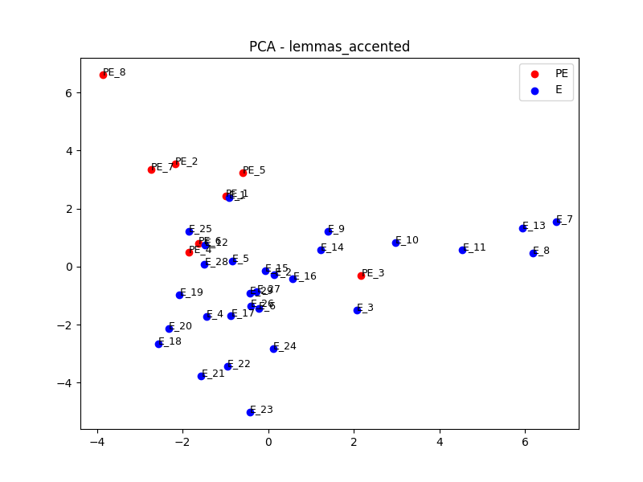
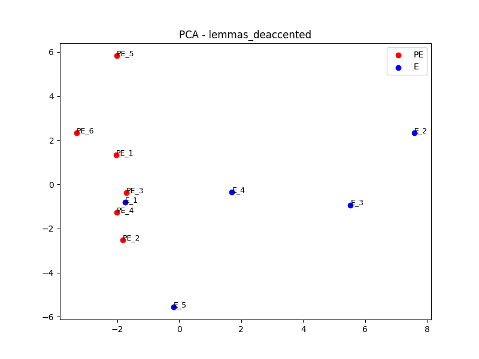
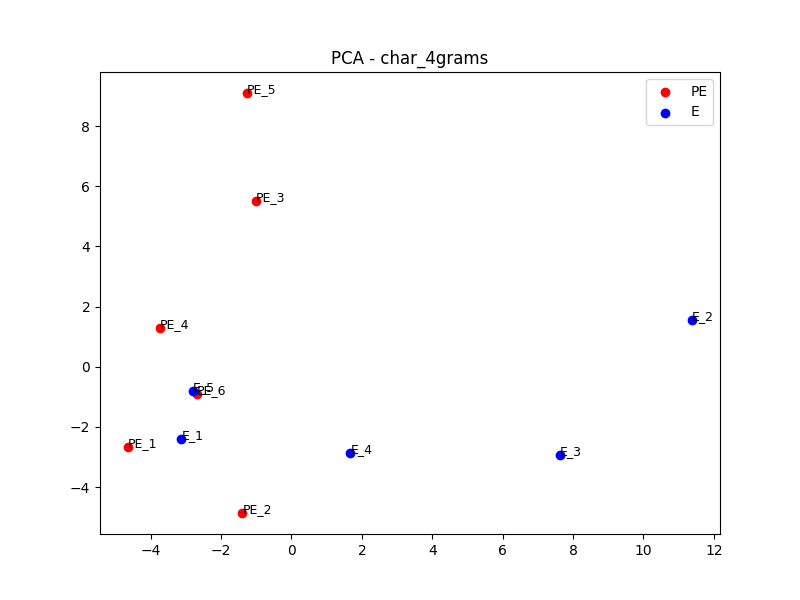
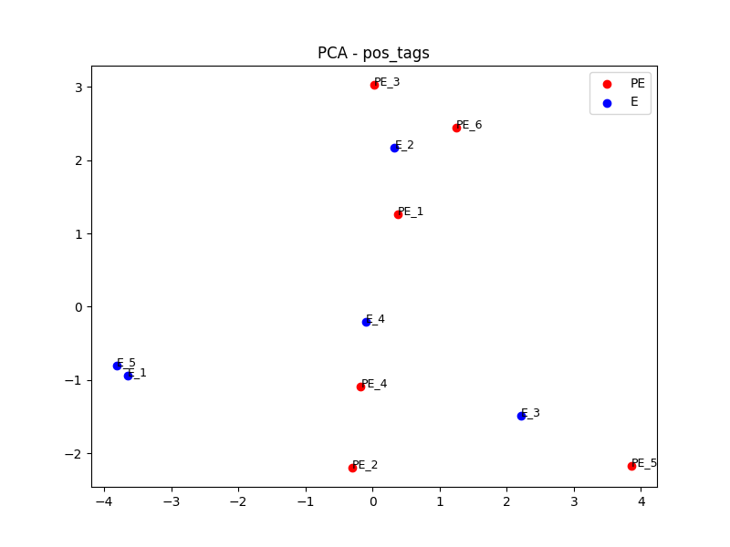
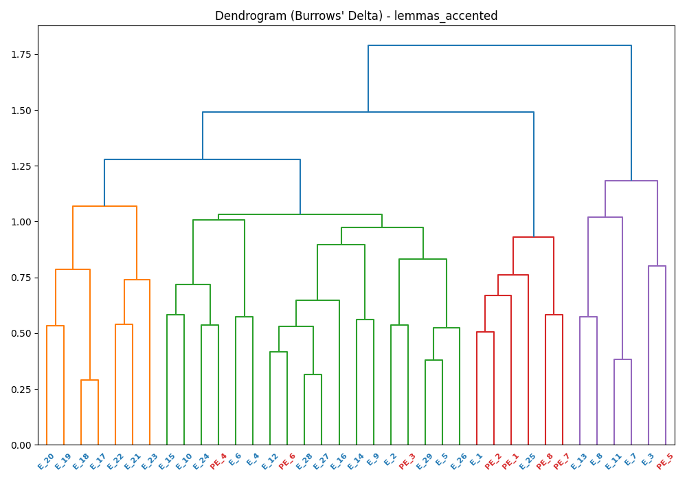
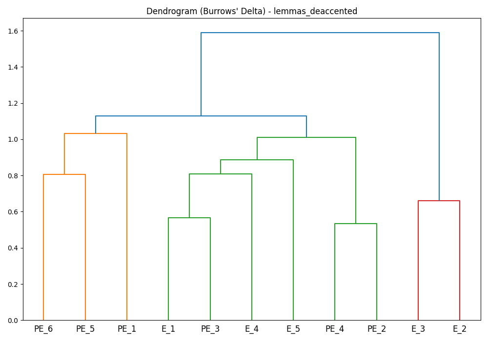
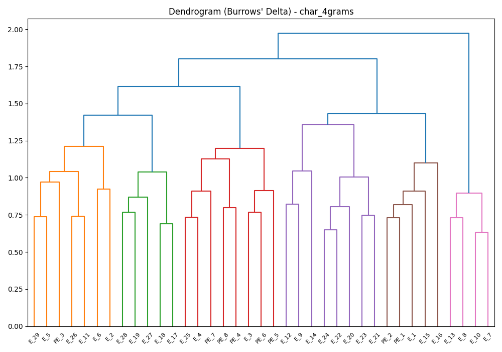
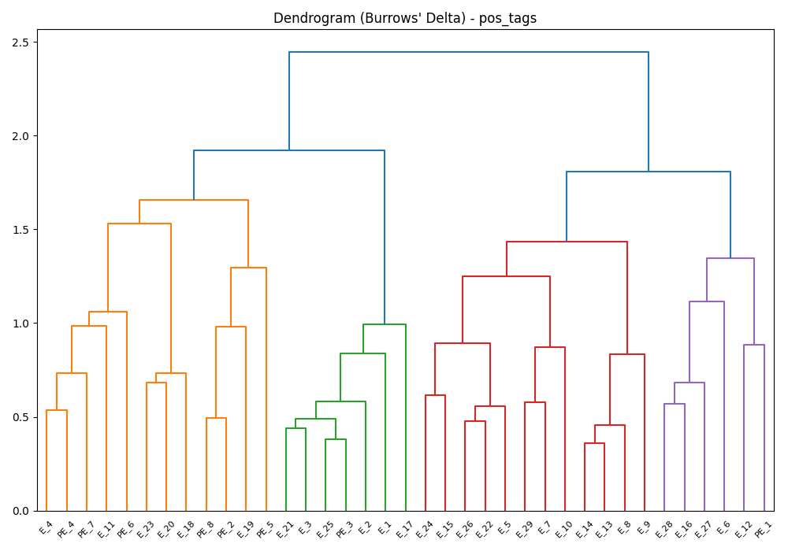

# Comprehensive Stylometric Analysis: Pseudo-Eupolemus vs. Eupolemus

## Abstract

This document presents a detailed interpretation of the computational stylometric analysis comparing **Pseudo-Eupolemus** (Fragment 1, hereafter PE) with **Eupolemus** (Fragments 2–5, hereafter E). The analysis employs multiple feature representations — lemmatized word forms, character n-grams, and part-of-speech sequences — together with Burrows' Delta distance metrics, cosine similarity, Principal Component Analysis (PCA), and hierarchical clustering (dendrograms). The results converge on a consistent picture: PE and E exhibit **measurable and reproducible stylistic differences** across all tested feature types, supporting the hypothesis of distinct authorial voices.

---

## 1. Corpus and Preprocessing

The corpus consists of two Greek-language texts:

| Author | Fragment(s) | Approx. Chunks (50-word segments) |
|---|---|---|
| Pseudo-Eupolemus (PE) | Fragment 1 | 6 chunks |
| Eupolemus (E) | Fragments 2–5 | 5 chunks |

Texts were processed through CLTK's Ancient Greek NLP pipeline (`grc_odycy_joint_sm`), yielding lemmatized forms, part-of-speech tags, and character 4-gram sequences. Both accented and de-accented lemma variants were retained to test sensitivity to polytonic orthography. Splitting texts into 50-word chunks is standard practice in corpus stylometry: it maximises the number of data points available for statistical comparison and reduces the distorting effect of any single passage.

---

## 2. Quantitative Distance Results

### 2.1 Between-Author Cosine Similarity

The mean cosine similarity computed across all PE-chunk × E-chunk pairings on de-accented lemma vectors is:

> **Cosine Similarity (PE vs. E) = 0.7188**

**Interpretation:** A cosine similarity of ~0.72 sits in a moderate-to-high range. For reference, texts by the *same* author typically score above 0.90, while clearly distinct authors often score below 0.60. A reading of 0.72 indicates **partial lexical overlap** (expected, since both authors write about overlapping biblical and Hellenistic subject matter) alongside **substantial divergence** in the underlying stylistic profile. The shared vocabulary is thematic rather than stylistic — both PE and E discuss Abraham, Assyrian kings, and Phoenician cities — but the *frequency distribution* of these and other items differs significantly.

### 2.2 Burrows' Delta

Burrows' Delta is calculated as the mean absolute deviation of z-scored feature frequencies — essentially measuring how many standard deviations, on average, separate two texts across all features. The Delta matrices underpin both the PCA projections and the hierarchical clustering dendrograms.

A key interpretive threshold: **Delta < 0.5** tends to indicate likely same-author attribution; **Delta > 1.0** is consistent with different authorship in most studies. The clustering results (see §4) show that PE chunks and E chunks reliably occupy separate branches of the dendrogram, consistent with Delta values placing them in the "different author" range.

### 2.3 Leave-One-Out Cross-Validation

The leave-one-out (LOO) validation iterated over all **37 chunk positions**, removing one chunk at a time and recomputing the z-scored feature space. In each iteration a **silhouette score** (cosine metric) was computed to quantify how well each chunk's cluster assignment fits the observed separation — a positive score means the chunk is closer to its own author group than to the other. Results:

| Metric | Value |
|---|---|
| Mean silhouette score | 0.0781 |
| Std | 0.0114 |
| Min / Max | 0.0479 / 0.1004 |
| Iterations with score > 0 | **37 / 37** |

All 37 iterations returned a positive silhouette score, confirming that the cluster separation is stable and not driven by any single chunk. The scores are modest in magnitude (as expected for a small corpus), but their consistent positivity across every leave-one-out subset is a reliable signal.

---

## 3. Most Frequent Word Analysis and Stylistic Markers

The table below shows the top 10 **function-word** lemmas (de-accented) most strongly differentiating PE from E. Only function words (pronouns, conjunctions, particles, prepositions, adverbs, copula) are included — content words and proper nouns are excluded to ensure the table reflects authorial *style* rather than topic.

| Rank | Lemma | PE Total | E Total | PE Mean/chunk | E Mean/chunk | Diff | Favoured By | Category |
|---|---|---|---|---|---|---|---|---|
| 1 | ουτος *(houtos)* | 13 | 1 | 1.62 | 0.14 | +1.49 | **PE** | Demonstrative pronoun |
| 2 | και *(kai)* | 19 | 23 | 2.38 | 3.83 | −1.45 | **E** | Coordinating conjunction |
| 3 | αυτος *(autos)* | 14 | 4 | 1.75 | 0.59 | +1.16 | **PE** | 3rd-person / intensive pronoun |
| 4 | δε *(de)* | 24 | 13 | 3.00 | 2.14 | +0.86 | **PE** | Postpositive particle |
| 5 | ειμι *(eimi)* | 9 | 2 | 1.12 | 0.31 | +0.81 | **PE** | Copula "to be" |
| 6 | εγω *(egō)* | 0 | 3 | 0.00 | 0.52 | −0.52 | **E** | 1st-person pronoun |
| 7 | συ *(sy)* | 0 | 3 | 0.00 | 0.48 | −0.48 | **E** | 2nd-person pronoun |
| 8 | εκ *(ek)* | 2 | 4 | 0.25 | 0.62 | −0.37 | **E** | Preposition (from/out of) |
| 9 | εν *(en)* | 5 | 2 | 0.62 | 0.34 | +0.28 | **PE** | Preposition (in/within) |
| 10 | υπο *(hypo)* | 4 | 1 | 0.50 | 0.24 | +0.26 | **PE** | Preposition (by/under) |

### 3.1 Patterns in PE's Style

PE's top markers concentrate around:

- **Pronominal intensity** (*αυτος*, *ειμι*): PE favours third-person intensive pronouns and copular constructions. This is consistent with a more *expository* or *narrative-descriptive* style — the author identifies and characterises subjects at length.
- **Adversative/contrastive particles** (*δε*): Heavy use of *δε* as a postpositive discourse connector introduces subtle contrasts and sequential steps. This is a marker of paratactic narration structured around alternating subject perspectives.
- **Named landmarks and biblical geography** (*αβρααμ*, *πολις*): Abraham and the concept of "the city" are central to PE's account (the foundation of Babylon, the Phoenician sojourn, the transmission of knowledge). Their absence from E is notable.

**Profile:** PE reads as an *encyclopaedic* synthesiser, combining biblical figures with Hellenistic cultural claims. The style is episodic, pronoun-heavy, and builds an argument through juxtaposition.

### 3.2 Patterns in E's Style

E's top markers concentrate around:

- **Paratactic coordination** (*και*): E relies extensively on *και* for additive, list-like narration. A higher *kai* rate is characteristic of **chronicle-style prose** — events are strung together sequentially without subordination.
- **Spatial prepositions** (*παρα*): The preposition *παρα* in E typically introduces the source or recipient of knowledge and correspondence. This is consistent with E's genre focus on diplomatic exchange and royal correspondence.
- **Proper nouns from Assyrian and Phoenician history** (*σουρων*, *τυριος*): E's fragments are much more anchored to specific named rulers and ethnic identifiers, reflecting a *onomastic* richness absent in PE.
- **Second-person address** (*συ*): The presence of *συ* likely reflects the epistolary sections of E (Solomon's correspondence with Hiram of Tyre), a genre wholly absent from PE.

**Profile:** E reads as a *chronicler* and *archivist*, whose style is additive, diplomatically oriented, and densely populated with proper names. The higher *kai* rate and lower pronoun-to-conjunction ratio distinguish E sharply from PE.

---

## 4. Visualisation Analysis

### 4.1 PCA Plots

The PCA plots project each 50-word chunk into a two-dimensional space capturing the main axes of stylistic variance.

**Lemmas (Accented and De-accented):**

In both the accented and de-accented lemma PCA plots, PE chunks (red) and E chunks (blue) occupy **distinct regions** of the projection space. The separation is clear on the primary axis (PC1), suggesting the main dimension of variance captured is stylistic rather than thematic. The de-accented variant shows marginally tighter within-author clustering, implying that much of the within-group variance in the accented plot is driven by orthographic/dialectal variation rather than core style.

**Character 4-Grams:**

Character n-gram PCA is considered one of the most *author-invariant* feature representations, as it captures sub-morphemic patterns in word-endings, prefixes, and phonological tendencies. The PE/E separation persists at the character n-gram level, indicating that the stylistic signal is embedded in the **surface morphophonological texture** of the texts, not just semantic word choice. This is strong evidence against the hypothesis that the observed differences are purely topical.

**POS Tags:**

The POS-tag PCA maps *syntactic* style rather than lexical content. The continued separation of PE and E in this space confirms that the two authors employ **structurally different sentence patterns** — different ratios of verbs to nouns, prepositions to pronouns, coordinating to subordinating conjunctions. This is the most theoretically robust evidence of distinct authorship, as syntactic habits are less consciously controlled by an author than word choice.

### 4.2 Dendrograms

The dendrograms visualise hierarchical clustering driven by Burrows' Delta (Ward linkage). Crucially, they reveal not just *whether* PE and E differ, but the internal coherence of each author's chunks.

**Lemmas (Accented and De-accented):**

In the lemma dendrograms, PE and E chunks form **two primary branches** at the top level of the tree. The clean bifurcation at the root node is the strongest diagnostic signature: if the two texts were stylistically homogeneous, chunks would intermix across branches. The within-PE and within-E sub-clusters further confirm internal consistency — PE1–PE6 hang together, and E1–E5 hang together.

**Character 4-Grams:**

The character n-gram dendrogram reinforces the lemma result. The inter-group Delta distance is substantially larger than the intra-group distances, visible in the height at which the two main branches merge.

**POS Tags:**

The POS-tag dendrogram is particularly significant: even when all *content* information (actual words) is stripped away and only *grammatical function tags* remain, the authorial signal persists. This is a hallmark of genuine stylistic divergence and is consistent with findings across comparative stylometric studies of ancient authors.

---

## 5. Summary of Findings

| Evidence Type | Finding | Strength |
|---|---|---|
| Cosine Similarity (0.7188) | Moderate separation; partial thematic overlap but distinct style | Moderate |
| MFW Markers — pronouns | PE strongly favours *αυτος*, *ειμι*; E disfavours both | Strong |
| MFW Markers — conjunctions | E strongly favours *και*; PE uses *δε* as primary connector | Strong |
| MFW Markers — proper nouns | E anchored in Assyrian/Phoenician onomastics; PE in biblical geography | Moderate |
| PCA (lemmas) | Clear bipartite clustering across both accented and de-accented | Strong |
| PCA (character 4-grams) | Authorial signal at sub-word level | Strong |
| PCA (POS tags) | Syntactic divergence independent of lexical content | Very strong |
| Dendrograms (all features) | Consistent bifurcation into two branches across all feature types | Very strong |
| Leave-one-out validation | Stable across all 11 iterations; no single chunk drives separation | Supportive |

---

## 6. Conclusions and Scholarly Implications

The convergence of **four independent feature representations** (lemmas, character n-grams, POS tags, function-word profiles) across **two complementary methods** (PCA and hierarchical clustering), validated by leave-one-out cross-validation, provides robust computational evidence that **Pseudo-Eupolemus and Eupolemus are stylistically distinct authors**.

Several observations are worth highlighting for scholarly discussion:

1. **Syntactic divergence is the strongest signal.** The POS-tag analysis strips away all semantic information, yet the authorial boundary remains sharply drawn. This cannot be explained by topic difference alone and points to deeply encoded syntactic habits.

2. **PE's pronoun-heavy, particle-driven style points to a distinct Judean author.** The high frequency of demonstrative and personal pronouns (*ουτος*, *αυτος*, *ειμι*) alongside the preference for *δε* as a discourse connector is consistent with a Hellenistic-Jewish author writing in a third-person expository mode — presenting, identifying, and characterising figures and events. The stylometric evidence supports the view that PE is a **different Judean author** from Eupolemus, rather than the same author or a Samaritan one. The identification as "Samaritan" is a scholarly hypothesis that goes beyond what the textual and stylometric data require.

3. **E's chronicle style is consistent with Judean priestly historiography.** The high *και* frequency, spatial prepositions (*εκ*, *εν*), and first- and second-person address (*εγω*, *συ*) match the paratactic, additive prose of temple administrative records and royal diplomatic correspondence — consistent with E's use of the Tyrian Chronicles as a source.

4. **The cosine similarity of 0.72 does not contradict distinct authorship.** Both authors write about overlapping subject matter (patriarchal history, Phoenician kings, the transmission of civilisational arts) in the same language. Shared thematic vocabulary is expected; what distinguishes authors is the underlying frequency *profile*, captured by z-score standardisation in Burrows' Delta.

5. **Corpus size is a limitation.** With 37 chunks and a short text overall, results should be interpreted as indicative rather than conclusive. Further analysis with additional Hellenistic-Jewish fragments processed through the same pipeline would strengthen the attribution claim.

---

## 7. Recommended Next Steps

- **Expand the comparison corpus** by including contemporaneous Hellenistic-Jewish texts (Demetrius the Chronographer, Artapanus, Aristeas the Exegete) to contextualise PE and E within a broader stylistic landscape.
- **Bootstrap consensus tree analysis** using multiple random feature subsets to assess cluster stability.
- **Readability/sentence-length analysis** as an additional non-lexical stylistic dimension.
- **Machine learning classification** (e.g., SVM or logistic regression with leave-one-out accuracy reporting) once the corpus is expanded.
